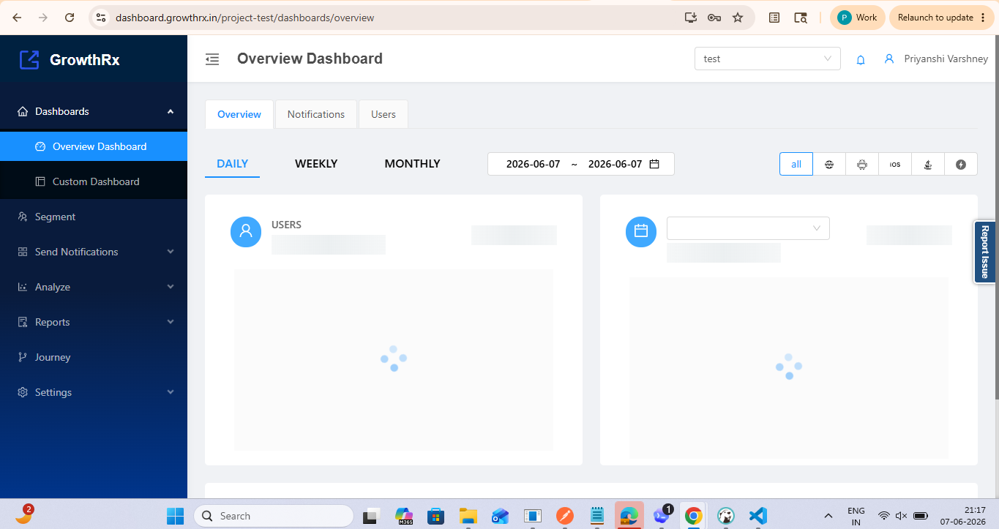

# GrowthRx Documentation



Welcome to the official GrowthRx documentation portal.

## Overview

GrowthRx is an internal customer engagement and analytics platform that enables teams to understand user behavior, create audience segments, automate communication, and measure campaign performance.

The platform provides capabilities for segmentation, multi-channel messaging, analytics, journey orchestration, and reporting through a unified interface.

## Documentation Index

### Getting Started

* [Getting Started](02-getting-started.md)

### Audience Segmentation

* [Segment](03-segment.md)

### Communication & Engagement

* [Notifications](04-notifications.md)

### Analytics & Insights

* [Analytics](05-analytics.md)

### Journey Automation

* [Journey](06-journey.md)

### Reporting

* [Reports](07-reports.md)

### Frequently Asked Questions

* [FAQ](08-faq.md)

## Platform Modules

| Module        | Description                                                                   |
| ------------- | ----------------------------------------------------------------------------- |
| Segment       | Create and manage user segments based on behavior and user attributes         |
| Notifications | Deliver communication through Email, SMS, Push, In-App, and WhatsApp channels |
| Analytics     | Analyze user activity, events, funnels, cohorts, and engagement metrics       |
| Journey       | Build automated workflows using triggers, conditions, and actions             |
| Reports       | Monitor campaign performance and operational metrics                          |
| FAQ           | Access common questions and platform guidance                                 |

## Key Capabilities

* Audience Segmentation
* Multi-channel Communication
* Journey Automation
* User Analytics
* Campaign Reporting
* Personalized User Engagement
* Real-time User Insights
* Automated Customer Journeys

## Repository Structure

```text
Sample-GrowthRx-Documentation/
├── images/
│   └── growthrx-dashboard.png
├── README.md
├── 02-getting-started.md
├── 03-segment.md
├── 04-notifications.md
├── 05-analytics.md
├── 06-journey.md
├── 07-reports.md
└── 08-faq.md
```

## Support

For product-related queries, troubleshooting assistance, or feature-related guidance, please contact the GrowthRx Product Team.
